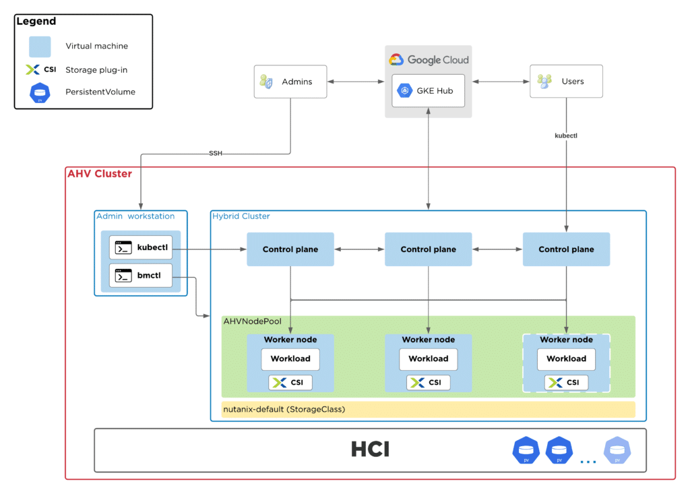

# Architecture

[Google Anthos](https://cloud.google.com/anthos){target=_blank} can be deployed on the Nutanix Cloud Infrastructure running Nutanix AHV hypervisor using the [Anthos clusters on bare metal](https://cloud.google.com/anthos/clusters/docs/bare-metal/latest) installation method. 

The Google Anthos nodes will be running as virtual machines on the Nutanix AHV hypervisor. The virtual machines need to run a validated operating system and version. 
The list of validated operating systems to run Google Anthos on Nutanix AHV can be found in the Nutanix section of the [partner platforms](https://cloud.google.com/anthos/docs/resources/partner-platforms#nutanix){target=_blank} page.

The [Nutanix CSI driver](https://portal.nutanix.com/page/documents/details?targetId=CSI-Volume-Driver-v2_6:CSI-Volume-Driver-v2_6){target=_blank} can be used to consume the storage provided by the Nutanix Cloud Infrastructure through Kubernetes Persistent Volumes. 

See the diagram below for a high-level architecture overview:
                

Refer to the [Nutanix HCI Now Runs as Google Cloud's Anthos](https://www.nutanix.com/blog/nutanix-hci-now-runs-google-anthos){target=_blank} article for more information on the partnership.

