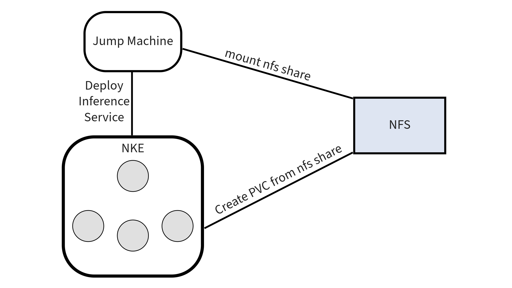

# Getting Started  
This is a guide on getting started with GPT-in-a-Box 1.0 deployment on a Kubernetes Cluster. You can find the open source repository for the K8s version [here](https://github.com/nutanix/nai-llm-k8s).

## Setup

Inference experiments are done on a single NKE Cluster with Kubernetes version 1.25.6-0. The NKE Cluster has 3 non-gpu worker nodes with 12 vCPUs and 16G memory and 120 GB Storage. The cluster includes at least 1 gpu worker node with 12 vCPUs and 40G memory, 120 GB Storage and 1 A100-40G GPU passthrough.

!!! note
    Tested with python 3.10, a python virtual environment is preferred to managed dependencies.

### Spec
**Jump node:**  
OS: 22.04  
Resources:   1 VM with 8CPUs, 16G memory and 300 GB storage  

**NKE:**  
NKE Version: 2.8  
K8s version: 1.25.6-0  
Resources:  3 cpu nodes with 12 vCPUs, 16G memory and 120 GB storage.
	        At least 1 gpu node with 12 vCPUs, 40G memory and 120 GB storage (1 A100-40G GPU passthrough)

**NFS Server:**    
Resources: 3 FSVMs with 4 vCPUs, 12 GB memory and 1 TB storage  


| Software Dependency Matrix(Installed)  | |
| --- | --- |
| Istio  | 1.17.2  |
| Knative serving  | 1.10.1  |
| Cert manager(Jetstack) | 1.3.0 |
| Kserve | 0.11.1 |

### Jump machine setup
All commands are executed inside the jump machine. 
Prerequisites are kubectl and helm. Both are required to orchestrate and set up necessary items in the NKE cluster.  

* [kubectl](https://kubernetes.io/docs/tasks/tools/#kubectl)
* [helm](https://helm.sh/docs/intro/install/)

Have a NFS mounted into your jump machine at a specific location. This mount location is required to be supplied as parameter to the execution scripts

Command to mount NFS to local folder
```
mount -t nfs <ip>:<share path> <NFS_LOCAL_MOUNT_LOCATION>
```



**Follow the steps below to install the necessary prerequisites.**  

### Download and set up KubeConfig  
Download and set up KubeConfig by following the steps outlined in [Downloading the Kubeconfig](https://portal.nutanix.com/page/documents/details?targetId=Nutanix-Kubernetes-Engine-v2_5:top-download-kubeconfig-t.html) on the Nutanix Support Portal.  

### Configure Nvidia Driver in the cluster using helm commands
For NKE 2.8, run the following command as per the [official documentaton](https://portal.nutanix.com/page/documents/details?targetId=Release-Notes-Nutanix-Kubernetes-Engine-v2_8:top-validated-config-r.html):
```
helm repo add nvidia https://nvidia.github.io/gpu-operator && helm repo update
helm install --wait -n gpu-operator --create-namespace gpu-operator nvidia/gpu-operator --version=v23.3.1 --set toolkit.version=v1.13.1-centos7
```

For NKE 2.9, refer the [official documentation](https://portal.nutanix.com/page/documents/details?targetId=Release-Notes-Nutanix-Kubernetes-Engine-v2_9:top-validated-config-r.html) for the validated config.

### Download nutanix package and Install python libraries  
Download the **v0.1** release version from [NAI-LLM-K8s Releases](https://github.com/nutanix/nai-llm-k8s/releases/tag/v0.1) and untar the release. Set the working directory to the root folder containing the extracted release.
```
export WORK_DIR=absolute_path_to_empty_release_directory
mkdir $WORK_DIR
tar -xvf <release tar file> -C $WORK_DIR --strip-components=1
```

### Kubeflow serving installation into the cluster
```
curl -s "https://raw.githubusercontent.com/kserve/kserve/v0.11.1/hack/quick_install.sh" | bash
```
Now we have our cluster ready for inference.  

### Install pip3  
```
sudo apt-get install python3-pip
```

### Install required packages  
```
pip install -r $WORK_DIR/llm/requirements.txt
```
